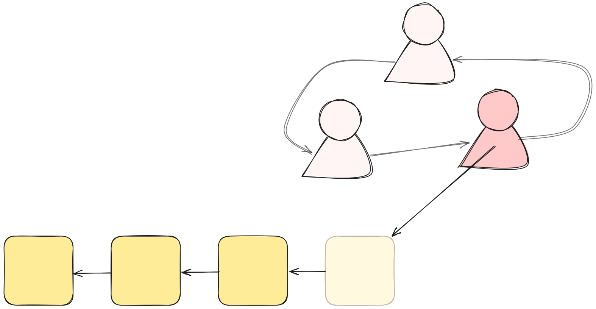
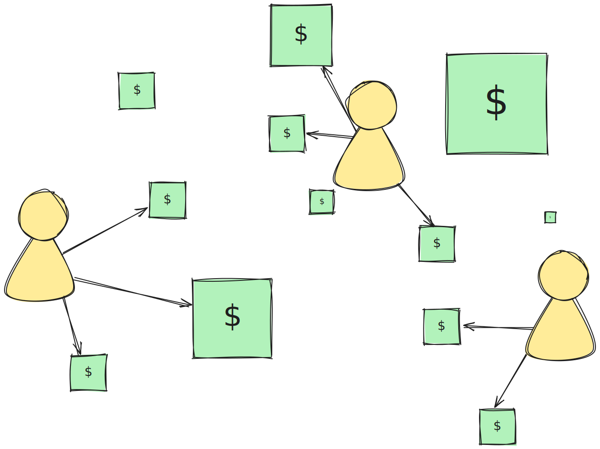
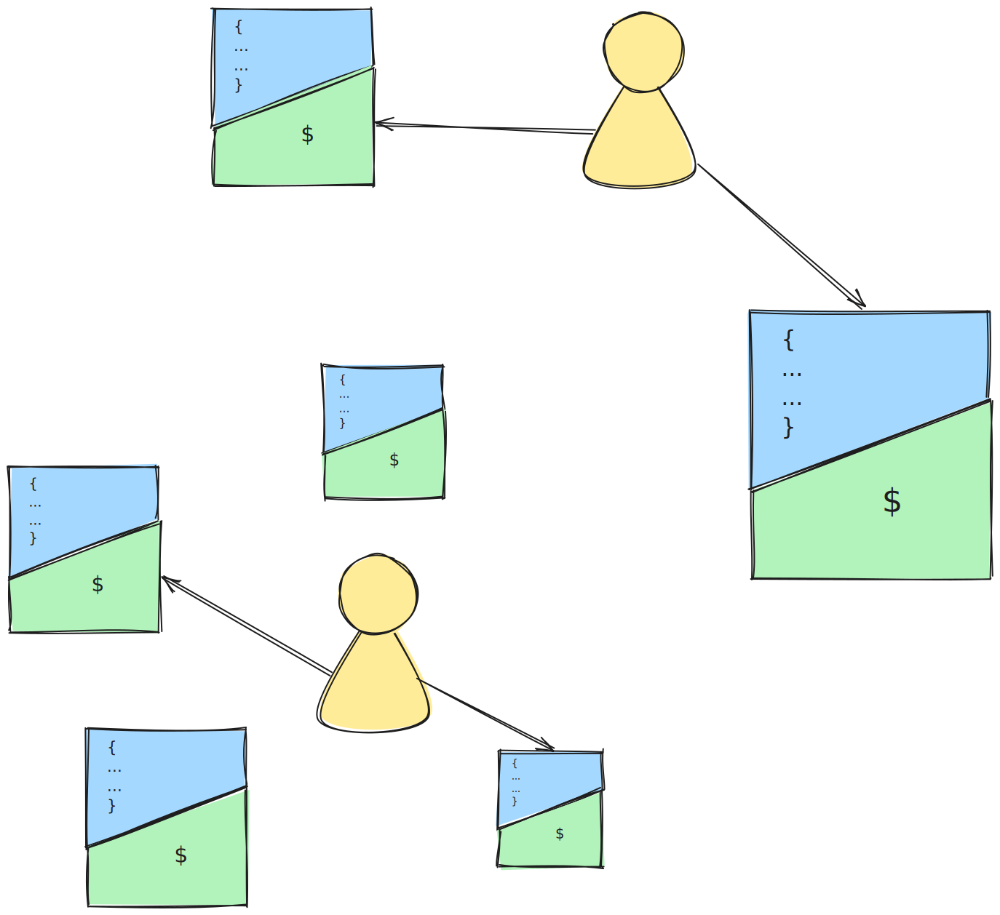
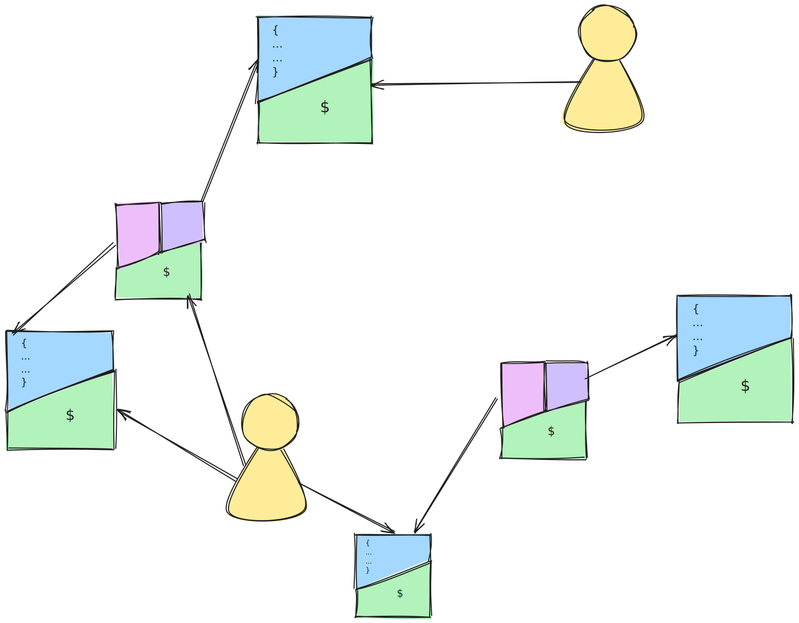
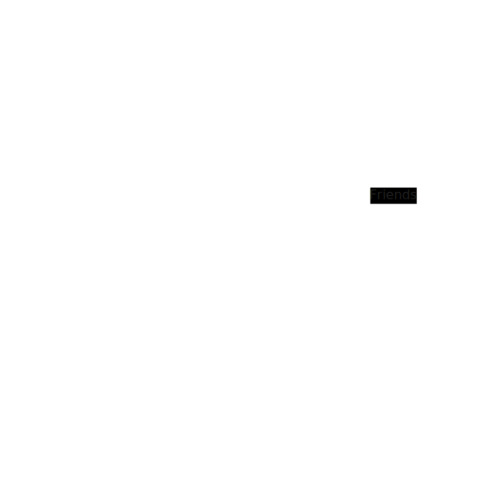

# Fundamentals

## Blockchain Fundamentals
There are many ways to describe a blockchain. That's part of the reason they're so hard to understand. The primary problem blockchains try to solve is censorship by powerful central authorities.

At its core, a blockchain offers a way for people to agree on a history of changes. Participants take turns adding to the "official" history.

The technical process for deciding who gets the next turn depends on the blockchain. In Bitcoin, for example, it's decided by whomever tries the hardest to solve a math puzzle, known as Proof-of-Work. In Giraffe, it's decided by a combination of wealth and randomness, known as Proof-of-Stake. Other consensus mechanisms exist, but the general idea is to establish a set of rules that, as long as a majority of people follow them, keep _everyone_ secure.

There is tremendous potential in the **changes** that can be described by a blockchain. By far the most common are **financial** transactions. In Bitcoin, funds are distributed amongst a big set of boxes, each filled with different amounts of cash. The whole world can see these boxes. The whole world knows what's in each box. But in order to spend the cash inside, you need to prove that you own it. The technical name for this is the "Unspent Transaction Output" (**UTxO**) model.

## Giraffe Fundamentals

Bitcoin pioneered decentralized finance, and while blockchain is conducive to finance, it's not the only application of **decentralization**. Instead of storing cash inside of a UTxO, you could store **data**. In fact, Giraffe Chain stores both, primiarily because data storage is not unlimited. By tying data storage to encumbered funds, the amount of "active" data can be capped.

Giraffe goes one step further: not only can you store data, but you can also connect data together. This model forms a **graph data structure**, where **vertices** represent objects and **edges** represent the relationships between them. Nothing exists in a vacuum; information is almost always related to some other piece of information.

 For example, a *person* may be *friends* with another *person*. By representing people as vertices and friendships as edges, a basic social network can be created.

